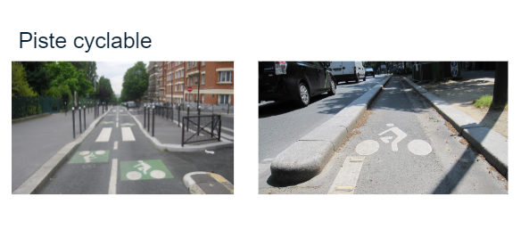
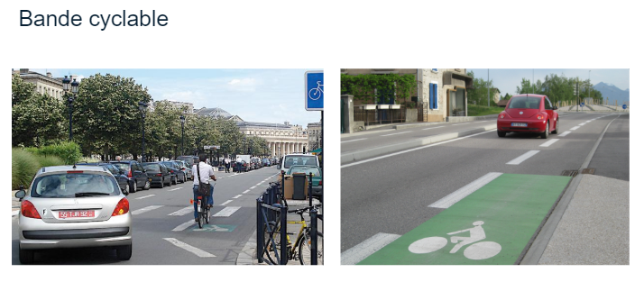
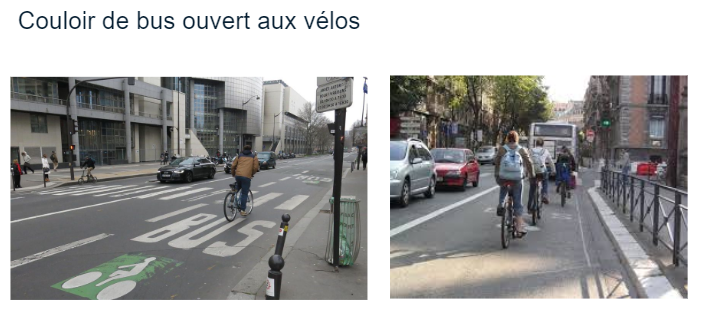
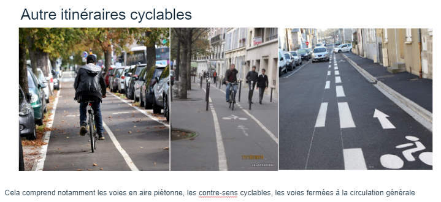
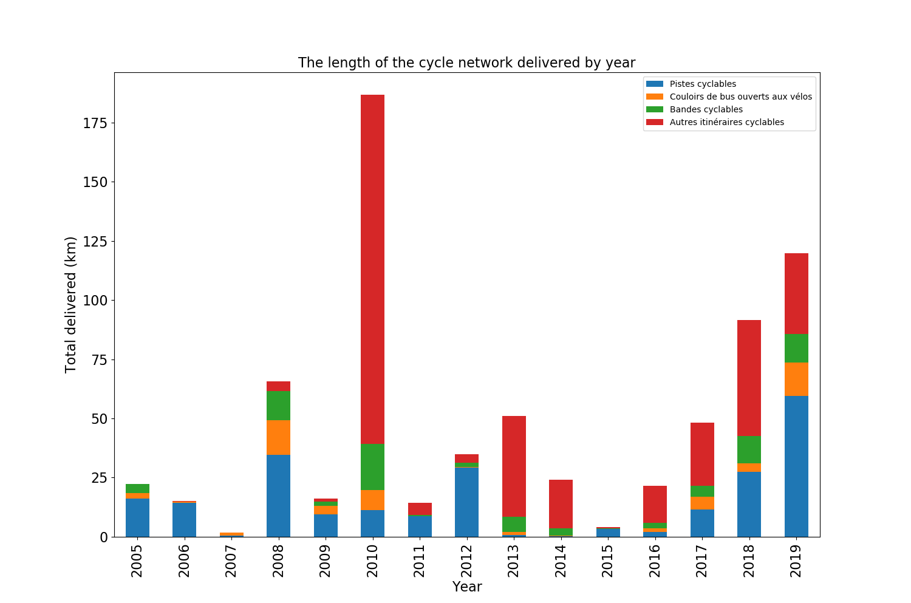
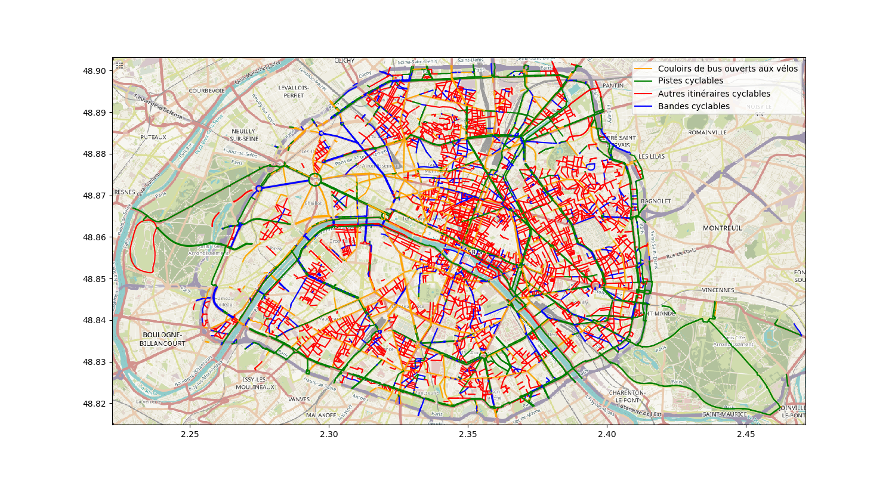
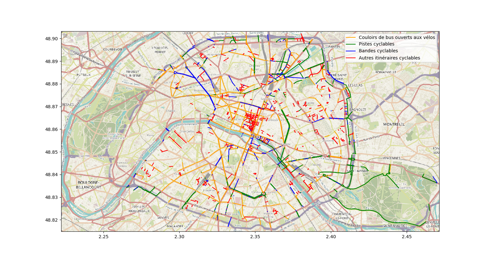
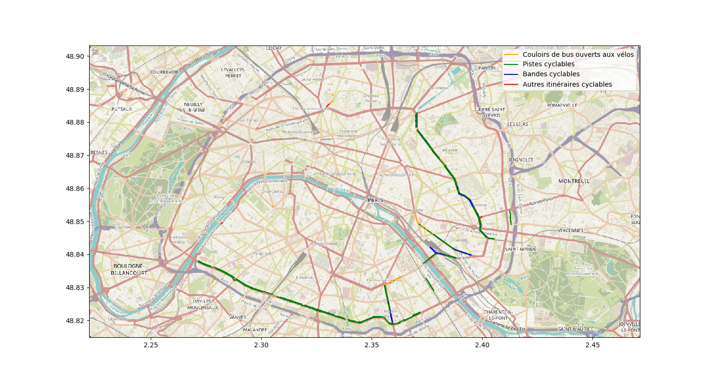
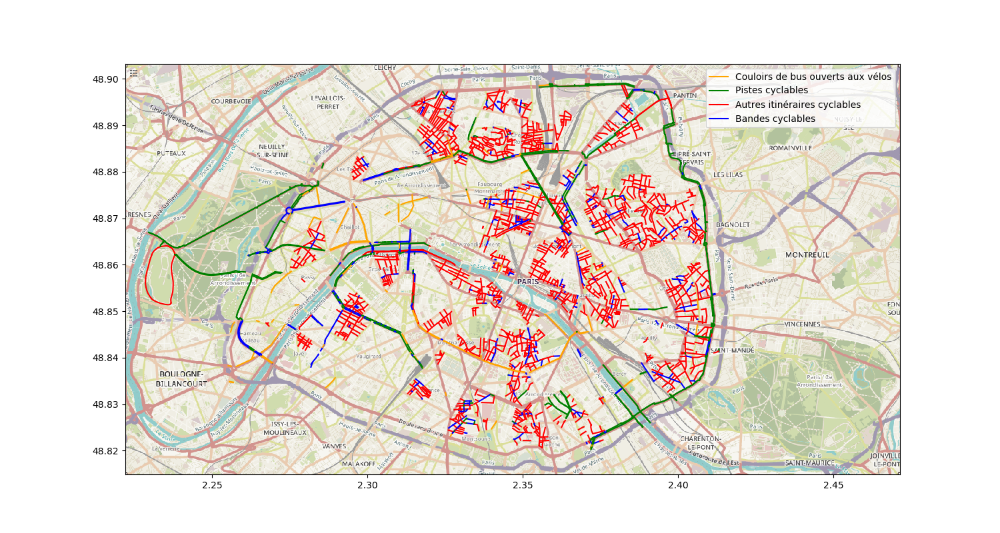

# Is Paris a Bike-Friendly City?

# Overview

After years of relying on shared bus and bike lanes to make up a significant part of its network, Paris is finally getting into gear and building out dedicated cycle tracks—including protected facilities on the Champs-Elysées. This new shift has bumped Paris up into the top 10 bike-friendly cities according to the wired magazine. Against fierce opposition, local politicians have stood firm as they have opened new cycling facilities and seen impressive results, like cyclists representing 30 percent of traffic on the Rue Rivoli, and more children riding their bikes than ever before.  

BUt how the bicycle network o Paris was developed over the last 15 years and how it is configured today, to answer this questions I've used the **Réseau des itinéraires cyclables** dataset from **opendata.paris.fr** and applied a few our data visualization skills to better uderstand it.
	
# What kind bikepaths thre are?

 * Piste Cyclables
It is a dedicated cycle tracks with a phisical separation beteween bicicles and cars
 

* Bandes cyclables

When there is a lane for bicicles shared with all other veichels

* Couloirs de bus ouverts aux velo

Shared lanes with buses

* Autre itineraires ciclables

All other types like, lanes over sidewalk, against the traffice flow or just in places with no other purpose

# Network Evolution

This graph show us the amount in kilometers that were delivered at each year, over the last 15 years

And here we can see how its network is configured today.

* Before 2000

For this period, data is not organazed very well and most of the cycle tracks deliverd/contructed dates are not define at the database. in order to overcome this , I seted this as the starting point of the analisis.

* From 2005 to 2006

There was a 30 km increase on the dedicated cycle track construction, but it lacked conection to the rest of the network, and was only concentrated at the border of the city, probably done as part of the avenue construction project.

* 2008 to 2014

Over 225km of cycle tracks were concluded in this period, but unfortunatelly most of it were from the "Other type" category, wich are tracks not very good for commuting. We can also see 73 km of  shared lanes and an impressive 93km of dedicated tracks, but again it looks like just as the extention of the previus case when this perimeter avenue was done.

* 2014 to 2019

Over this last period, a lot was done and althougth the "other type" was also the biggest amount overall, we can see an impresive 103km of dedicated cycle tracks including a main corridor from west-east, a North-south and one along river.

